Watson Conversation Tooling Introduction
========================================

© Copyright IBM Corporation 2017

IBM, the IBM logo and ibm.com are trademarks of International Business
Machines Corp., registered in many jurisdictions worldwide. Other
product and service names might be trademarks of IBM or other companies.
A current list of IBM trademarks is available on the Web at "Copyright
and trademark information" at www.ibm.com/legal/copytrade.shtml.

This document is current as of the initial date of publication and may
be changed by IBM at any time.

The information contained in these materials is provided for
informational purposes only, and is provided AS IS without warranty of
any kind, express or implied. IBM shall not be responsible for any
damages arising out of the use of, or otherwise related to, these
materials. Nothing contained in these materials is intended to, nor
shall have the effect of, creating any warranties or representations
from IBM or its suppliers or licensors, or altering the terms and
conditions of the applicable license agreement governing the use of IBM
software. References in these materials to IBM products, programs, or
services do not imply that they will be available in all countries in
which IBM operates. This information is based on current IBM product
plans and strategy, which are subject to change by IBM without notice.
Product release dates and/or capabilities referenced in these materials
may change at any time at IBM's sole discretion based on market
opportunities or other factors, and are not intended to be a commitment
to future product or feature availability in any way.

Overview
========

In this lab, you will familiarize yourself with the Watson Conversation
service tooling by starting to develop a sample restaurant chatbot that
handles reservations for a restaurant. This lab utilizes the new slots
feature in the Conversation service that enables you to gather multiple
pieces of information in a single dialog node and allow users of the
chatbot to provide required information proactively

Prerequisites
-------------

You need the following accounts and software:

-   An [IBM Bluemix
    account](https://developer.ibm.com/sso/bmregistration?lang=en_US&ca=dw-_-python-_-watson_-course)

-   An Internet Explorer, Firefox, or Chrome web browser

Lab Procedure
=============

The following steps will walk you through the procedure to create a
chatbot.

1.  Login to Bluemix and click on the **Catalog** link in the top-right corner of the Bluemix dashboard.

2.  Select the **Watson Conversation** tile under the section titled **Watson**.

    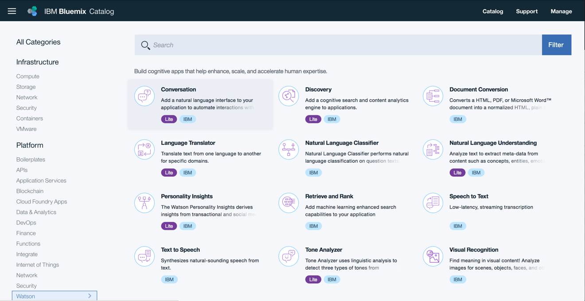

3.  Enter my-conversation-service in the field labeled **Service name**.
    Click on **Create**.

    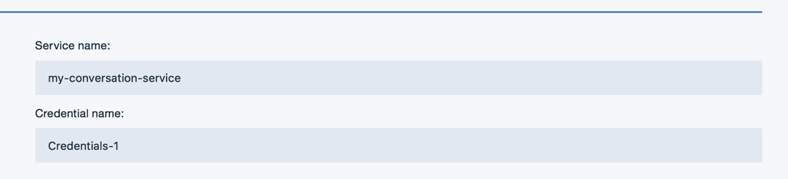

4.  Click on the green **Launch tool** button to launch into the Watson
    Conversation tooling.

    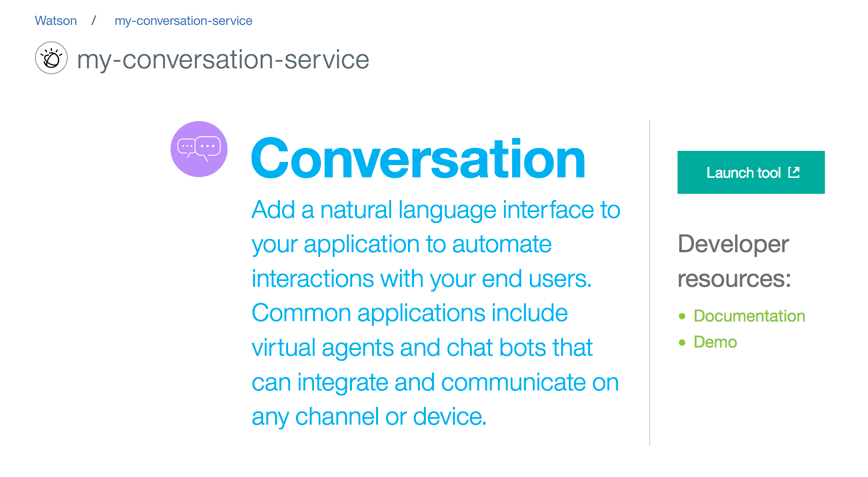

5.  This is the Watson Conversation tooling where you can create
    workspaces and setup different chatbots dialogues and applications.
    There is an example Cognitive Car Dashboard workspace where you can
    see a more evolved training. However, we'll create a new workspace
    for our bot to use. Click on the **Create** button in the box
    labeled **Create a new workspace**.

    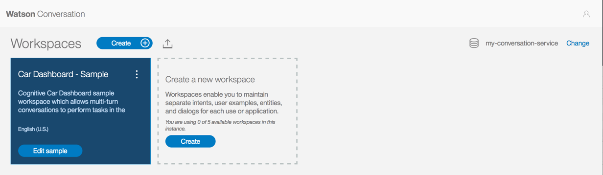

6.  Enter a name for the chatbot and a description as shown in the screenshot below. Click **Create** when finished.

    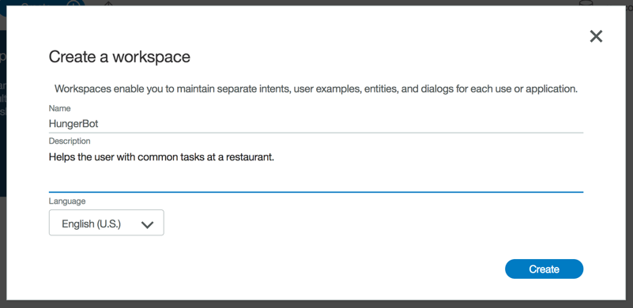

7.  You will be redirected into a page with three tabs, **Intents**,
    **Entities**, and **Dialog**. Under the **Intents** tab, click on
    **Create new** to create the first intent.

8.  Name the Intent **#book_reservation** . Add the five examples
    shown in the screenshot below. Click on **Done** when finished.

    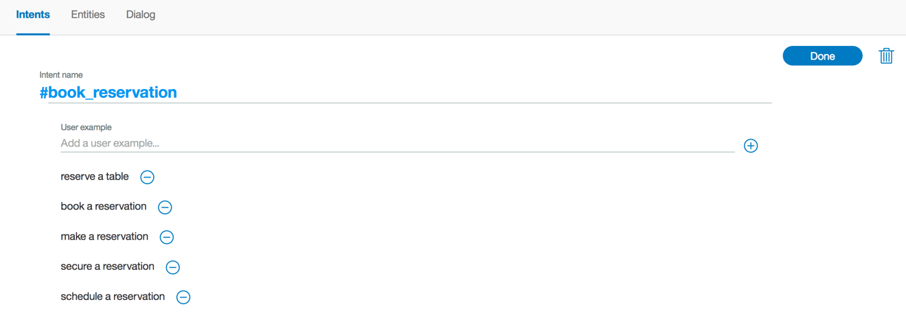

9.  Click on the **Entities** tab in the top menu bar. This is where you
    can add entities. Add an entity called **@cuisine** and then add the
    five entity values shown below. Click **Done** when finished.

    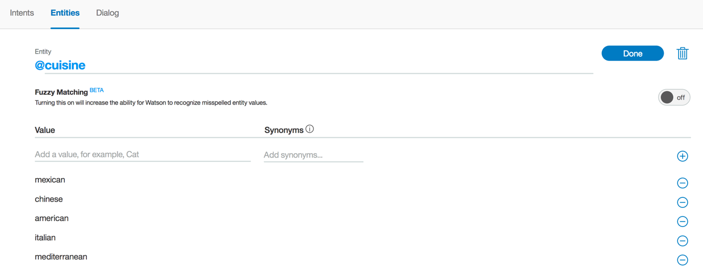

10.  The Watson Conversation has a handful of common entities created by
    IBM that can be used across any use case. These entities include:
    date, time, currency, percentage, and numbers. Click on **System
    entities**. Toggle on the switch for @sys-time, @sys-date, and
    @sys-number to enable the entities.

    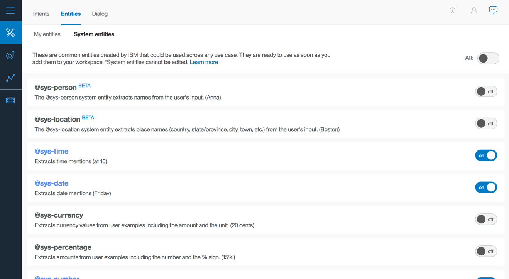

11.  Click on the **Dialog** tab in the top menu bar. Click **Create**.
    There are two nodes added by default. The welcome condition is
    triggered when the chatbot is initially started. This is a good
    place to introduce the bot and suggest actions the user can ask of
    this chatbot.

    

12.  The second node checks for the condition *anything else*. In the
    event the user enters something that wasn't expected, the service
    will return this response. Ideally, it should convey a way for the
    user to recover. Add one of the example phrases shown below

    

13.  Return back to the welcome node and click on the three dots on the
    right side of the node. Select **Add node below** from the menu.

    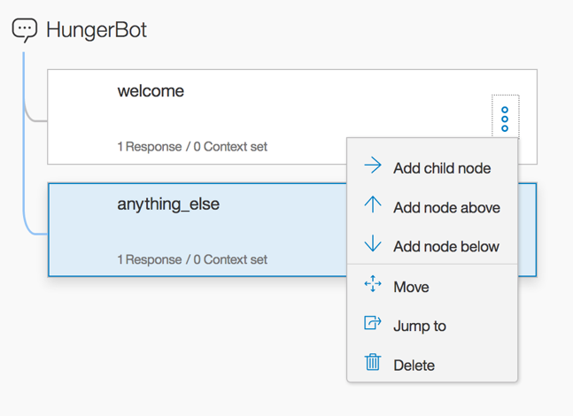

14.  Add a node to test the condition of the first intent,
    \#book_reservation, as shown below.

    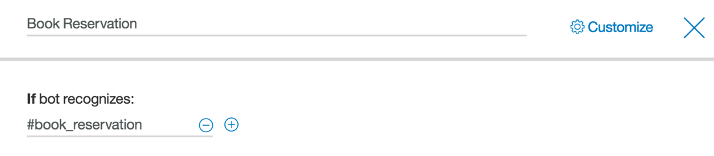

15.  Click on **Customize** in the top right corner. Enable **Slots** and
    **Prompt for everything**.

   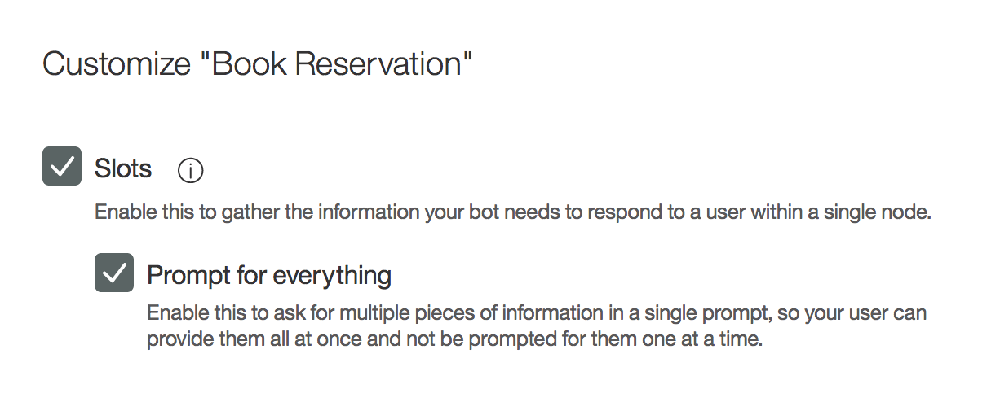}

16.  Add a slot for @cuisine, with the prompt *What type of cuisine would
    you like?*

   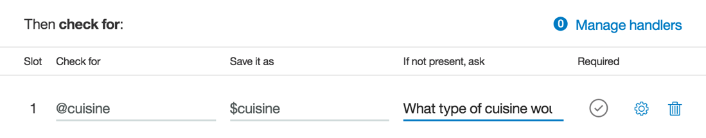

17.  Add another slot for @sys-date, with the prompt What day would you
    like to reserve?

    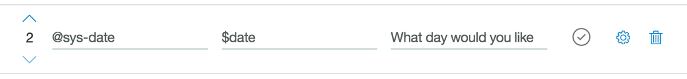

18.  Add another slot for @sys-time, with the prompt What time would you
    like to reserve?
    
    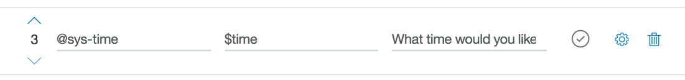
19.  Add another slot for @sys-number, with the prompt How many people
    will be coming?
    
    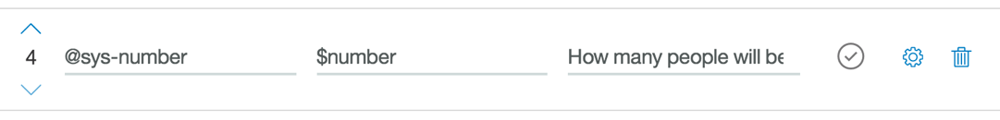

20.  If no slots are prefilled, prompt the user to provide a
    cuisine.
    
     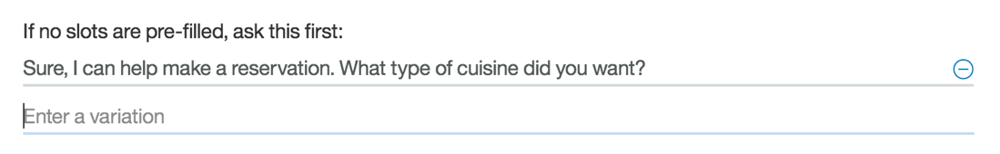
     
21.  Have the bot respond with the details of the reservation. The &lt;?
    … ?&gt; syntax uses the values stored in the context and injects
    them into the response.

    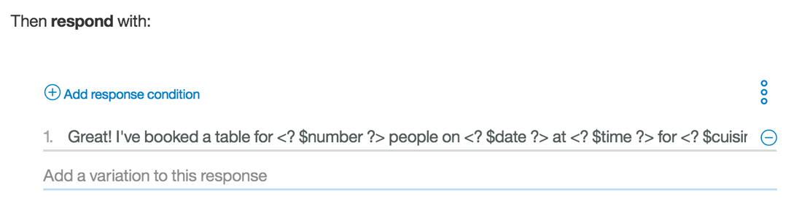

22.  To test the bot, click on the **Ask Watson** icon in the top-right
    corner of the tooling.

    

23.  A side panel appears and shows the contents of the node that matches
    welcome. Enter a message that triggers the #book_reservation
    intent. We can ask "book a table"

    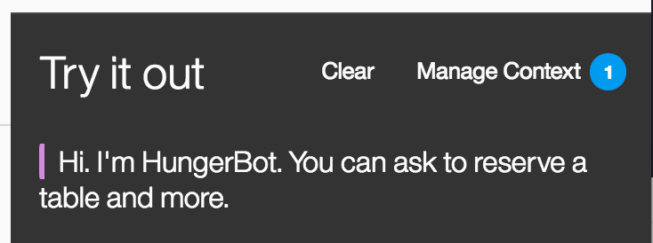

24.  Notice that the intent **\#book_reservation** was recognized. The
    **\#book_reservation** node was triggered and the output includes the
    response from the Book Reservation node. The user is prompted for a
    choice of cuisine.

    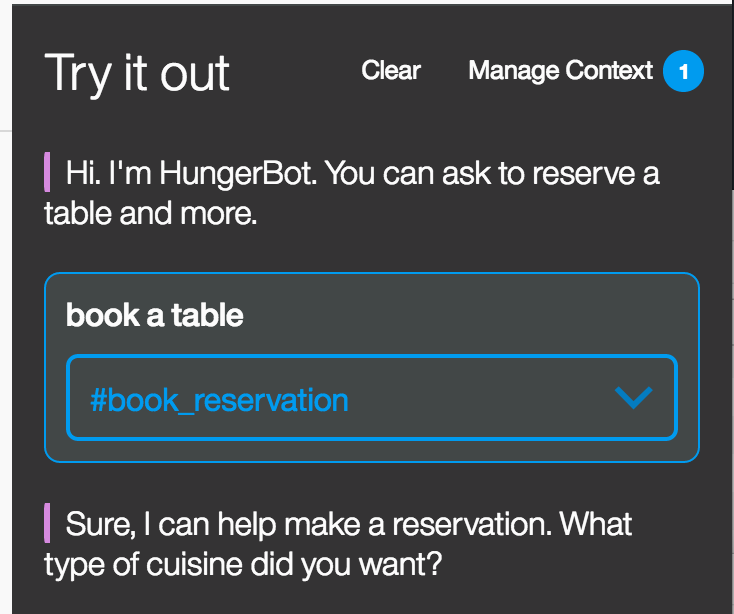

25.  When the user enters a cuisine, the *@cuisine* entity is recognized.

    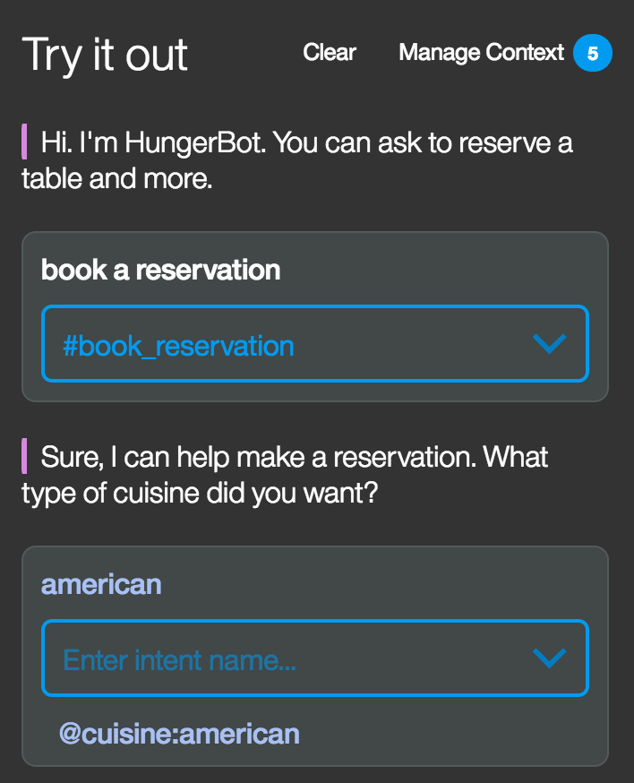

26.  When the user enters a date or time, Watson extracts out the value
    using the system entities *@sys-date* and *@sys-time*.

    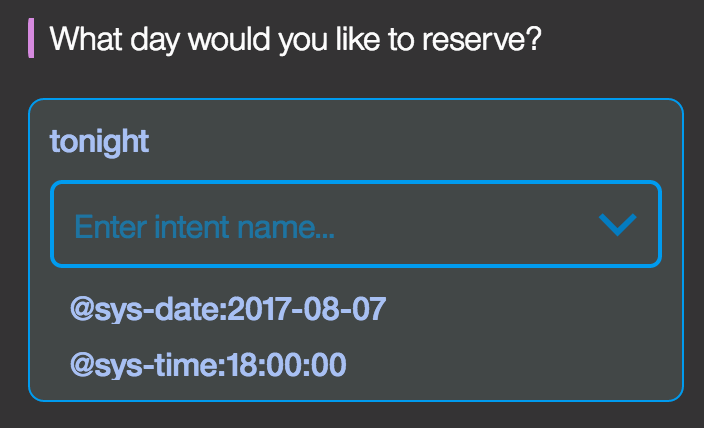

27.  Finally, when the user enters a number (either numerically or
    spelled out) for the number of people in the reservation, Watson
    extracts out the number using the system entity *@sys-number*.

    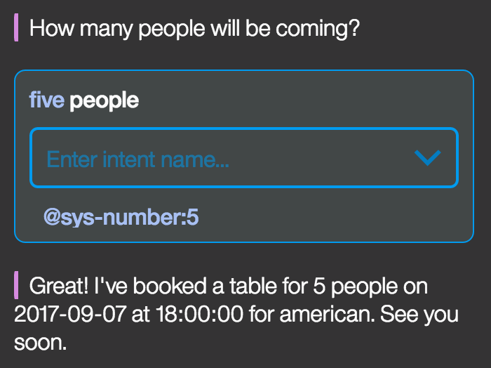

Summary 
--------

The Watson Conversation service is able to handle gathering multiple
pieces of information, parsing the user input, and placing the values
into a context that is used to inject into the response back to the
user.
