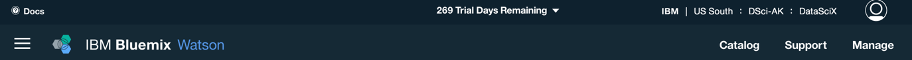
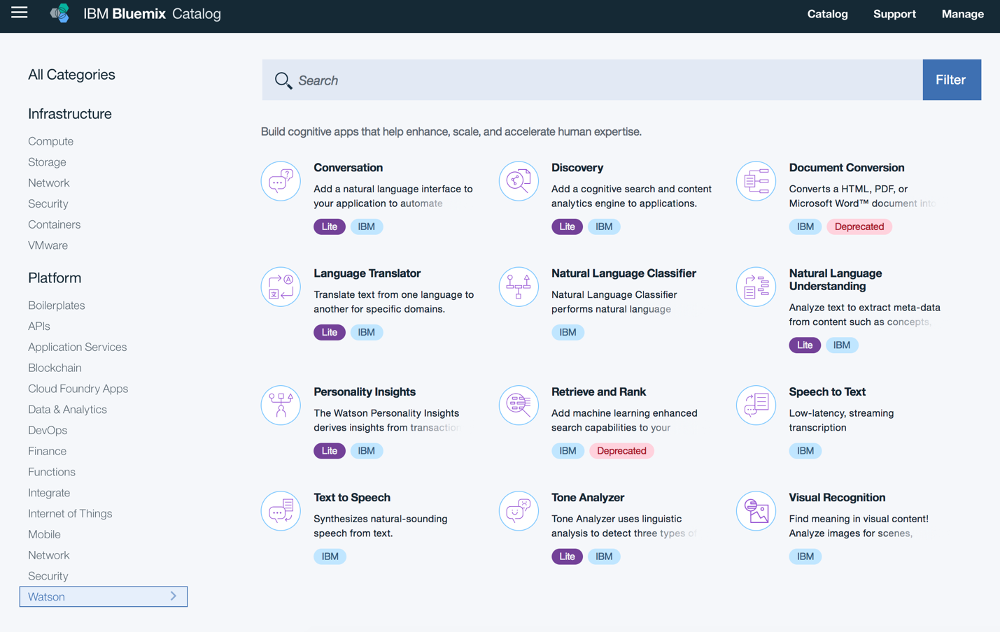
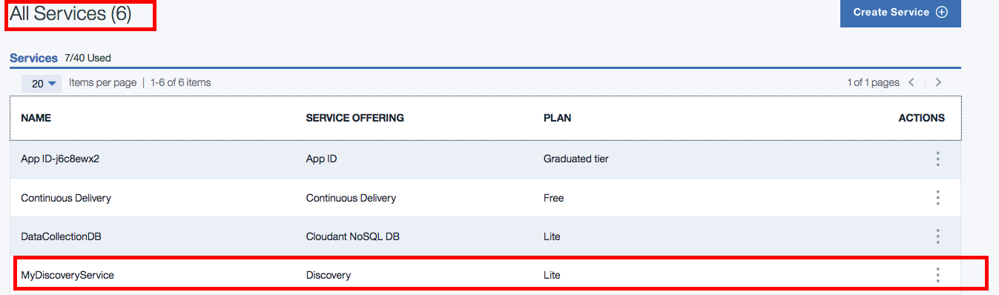
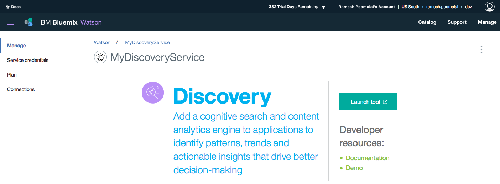
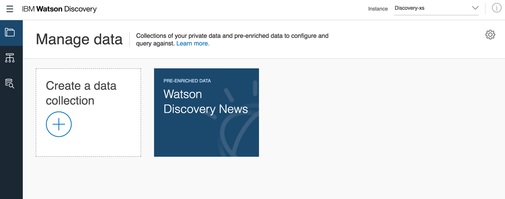
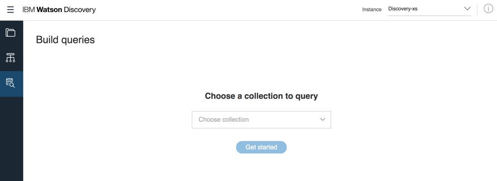
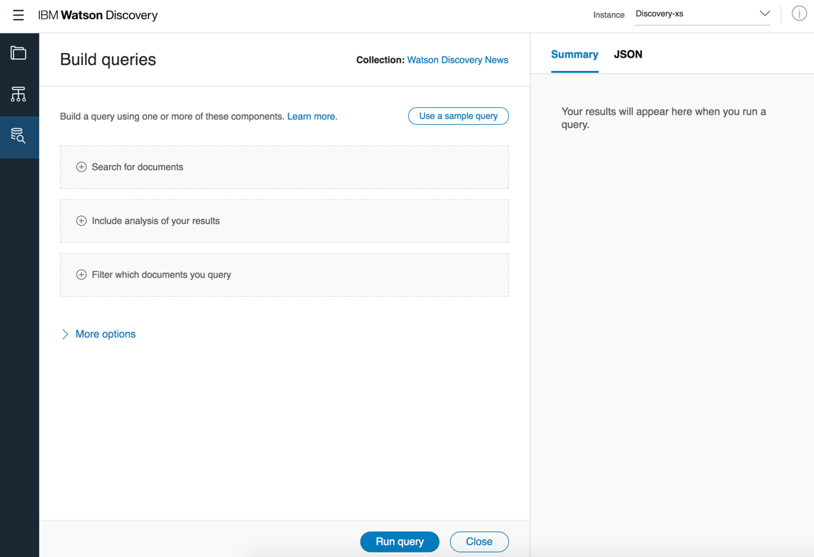
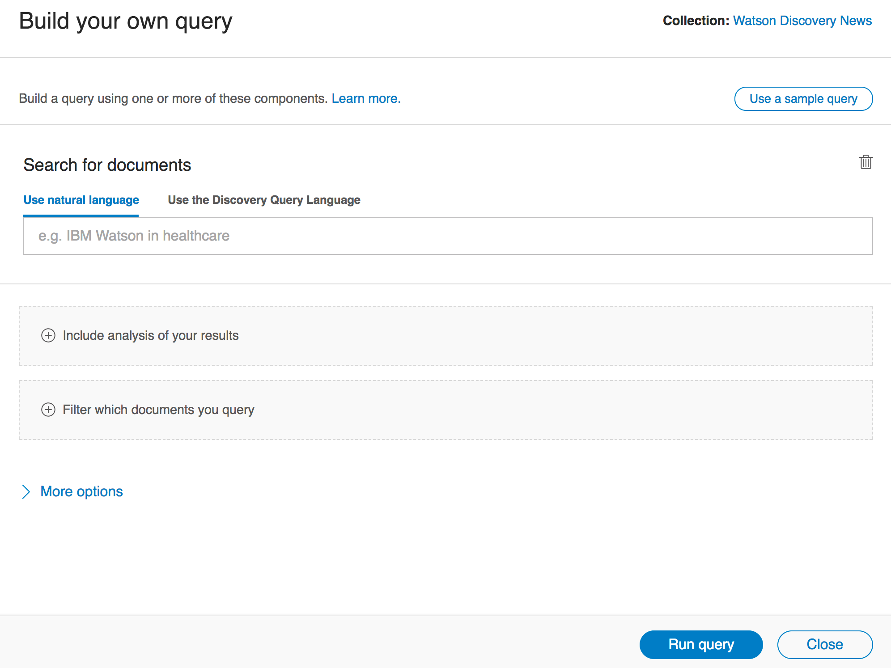
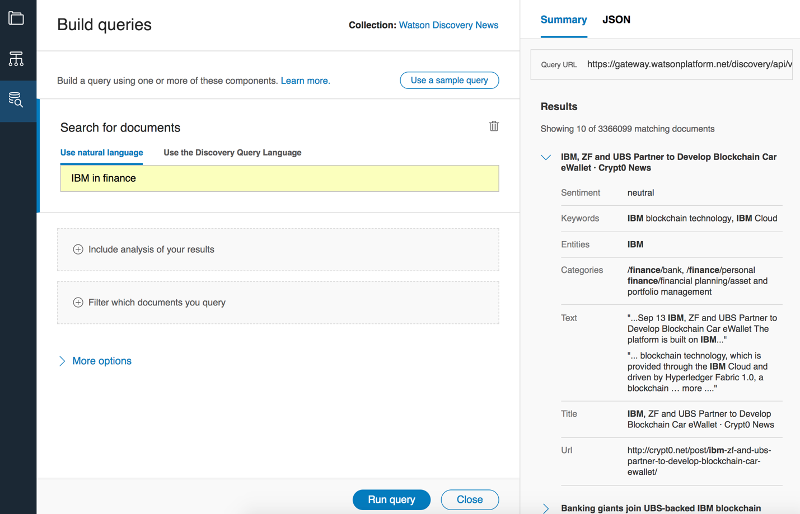

Querying Watson Discovery News 
===============================

© Copyright IBM Corporation 2017

IBM, the IBM logo and ibm.com are trademarks of International Business
Machines Corp., registered in many jurisdictions worldwide. Other
product and service names might be trademarks of IBM or other companies.
A current list of IBM trademarks is available on the Web at "Copyright
and trademark information" at www.ibm.com/legal/copytrade.shtml.

This document is current as of the initial date of publication and may
be changed by IBM at any time.

The information contained in these materials is provided for
informational purposes only, and is provided AS IS without warranty of
any kind, express or implied. IBM shall not be responsible for any
damages arising out of the use of, or otherwise related to, these
materials. Nothing contained in these materials is intended to, nor
shall have the effect of, creating any warranties or representations
from IBM or its suppliers or licensors, or altering the terms and
conditions of the applicable license agreement governing the use of IBM
software. References in these materials to IBM products, programs, or
services do not imply that they will be available in all countries in
which IBM operates. This information is based on current IBM product
plans and strategy, which are subject to change by IBM without notice.
Product release dates and/or capabilities referenced in these materials
may change at any time at IBM's sole discretion based on market
opportunities or other factors, and are not intended to be a commitment
to future product or feature availability in any way.

Overview
========

In this lab, you will familiarize yourself with the Watson Discovery
service by using the tooling to query Discovery News, an existing
dataset of English-language news sources that is updated continuously,
with approximately 300,000 new articles and blogs added daily.

Prerequisites
-------------

You need the following accounts and software:

-   An [IBM Bluemix
    account](https://developer.ibm.com/sso/bmregistration?lang=en_US&ca=dw-_-python-_-watson_-course)

-   An Internet Explorer, Firefox, or Chrome web browser

**Section 1. Create your instance
of Discovery Service**

The Discovery service enriches/indexes the documents into collections
and provides the options to query the collections. In this section,
you’ll create an instance of the Discovery Service

1.  In a web browser navigate to <https://bluemix.net/> and login to Bluemix

2.  Click on **Catalog**

    

3.  On the navigation menu on the left, select **Watson-&gt;Discovery**

    

4.  Enter service name, region to deploy, organization and space. Select the lite plan in pricing plans

    
    
5.  Click **Create**. The service is created in the respective region
    and space. The Apps and Service Dashboard is displayed after service
    creation is completed. The newly created service is displayed under
    “All Services”.

**Section 2. Launch the Discovery News Service Tool**

In this lab section, you will query the Discovery News Service from the
instance created above.

1.  In your browser go to the Bluemix Dashboard.

2.  Click on the Service name, which we created in section 1 under All
    Services section

   

3.  Click **“Launch Tool”**, in Discovery Service Manage Section.

    
    
4.  Click the Build Queries icon on the side navigation.

    

5.  You should see the page "Build queries" page. Choose "Watson
    Discovery News" in the drop down. Click **Get started**.

    

6.  A page will load allowing you to build queries and see the results.
    Expand the components on the build side to practice with the queries
    at the end of this lab. Let’s walk through the first one in the next
    section.

    

**Section 3. Query the Discovery News Service**

In this section, we will do a basic search for documents with “IBM in
finance”. The following shows the format for the queries.

Search:

IBM in finance

No aggregation.

No filter.

Resulting query string:

<https://gateway.watsonplatform.net/discovery/api/v1/environments/system/collections/news/query?version=2017-08-01&count=&offset=&aggregation=&filter=&passages=true&highlight=true&return=&natural_language_query=IBM%20in%20finance>

Now let’s go step by step to build this query.

1.  Expand the “Search for documents” component and type in “IBM in
    finance”.

    
    
2.  Leave analysis (aggregation) field blank. Leave filter field blank.

3.  Click **Run query**. Your results will appear in the Summary and
    JSON section on the right. Click **JSON** to see the resulting query
    string at the top.

    

    

Using the same process, build the queries that follow. 

**Hint:** Remember to
expand the component applicable to the query.

**Query: 50 most mentioned companies in the tech industry**

No search query.

Aggregation:

nested(enriched\_text.entities).filter(enriched\_text.entities.type::Company).term(enriched\_text.entities.text,count:50)

Filter:

enriched\_text.categories.label::/technology and computing

Resulting query string:
<https://gateway.watsonplatform.net/discovery/api/v1/environments/system/collections/news/query?version=2017-08-01&count=&offset=&aggregation=nested%28enriched_text.entities%29.filter%28enriched_text.entities.type%3A%3ACompany%29.term%28enriched_text.entities.text%2Ccount%3A50%29&filter=enriched_text.categories.label%3A%3A%2Ftechnology%20and%20computing&passages=true&highlight=true&return=&query>=

**Query: Use sentiment analysis to see if a given host site (Gizmodo)
has been publishing positive, negative, or neutral articles**

Search (Use natural language):

Host::gizmodo.com

Aggregation:

term(enriched\_text.sentiment.document.label)

No filter query.

Resulting query string:
<https://gateway.watsonplatform.net/discovery/api/v1/environments/system/collections/news/query?version=2017-08-01&count=&offset=&aggregation=term%28enriched_text.sentiment.document.label%29&filter=&passages=true&highlight=true&return=&natural_language_query=Host%3A%3Agizmodo.com>

**Query: Remove the junk**

Search (Use natural language):

Host::gizmodo.com, title:!deadspin

Aggregation:

term(enriched\_text.sentiment.document.label)

No filter query.

Resulting query string:

<https://gateway.watsonplatform.net/discovery/api/v1/environments/system/collections/news/query?version=2017-08-01&count=&offset=&aggregation=term%28enriched_text.sentiment.document.label%29&filter=&passages=true&highlight=true&return=&natural_language_query=Host%3A%3Agizmodo.com%2C%20title%3A%21deadspin>

**Query: Find the top 10 posts on Facebook Live with Oculus/VR**

Search:

Facebook Live

Aggregation:

filter(enriched\_title.entities.type::Company).top\_hits(10)

Filter:

Oculus

Resulting query string:

<https://gateway.watsonplatform.net/discovery/api/v1/environments/system/collections/news/query?version=2017-08-01&count=&offset=&aggregation=filter%28enriched_title.entities.type%3A%3ACompany%29.top_hits%2810%29&filter=Oculus&passages=true&highlight=true&return=&natural_language_query=Facebook%20Live>
