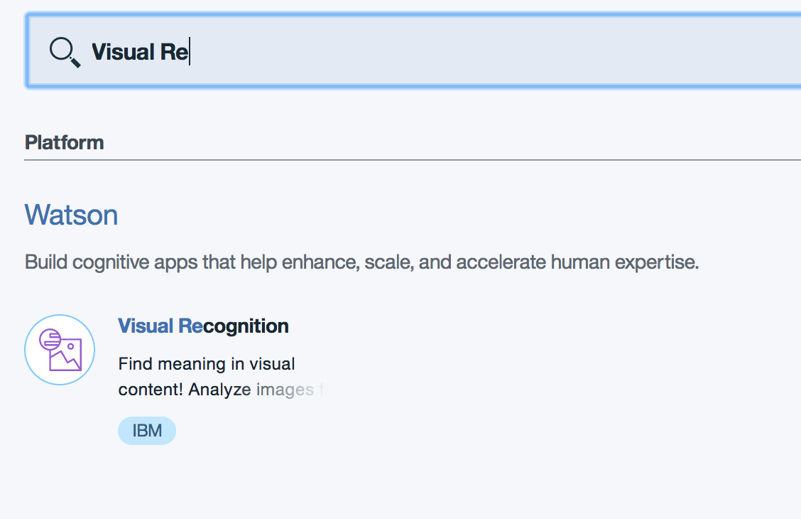
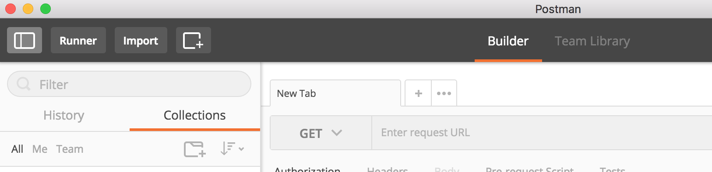
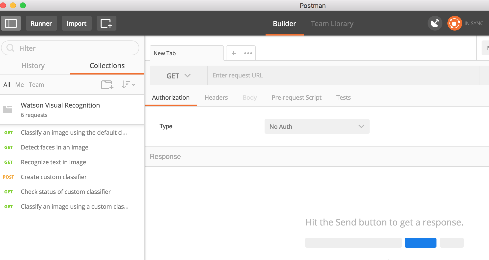
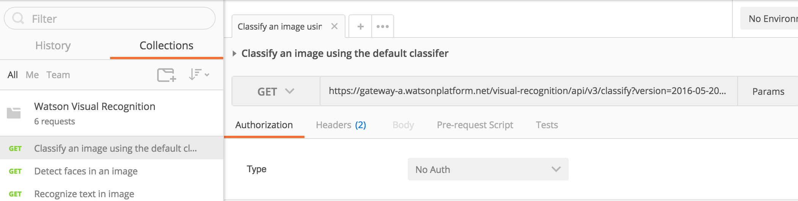
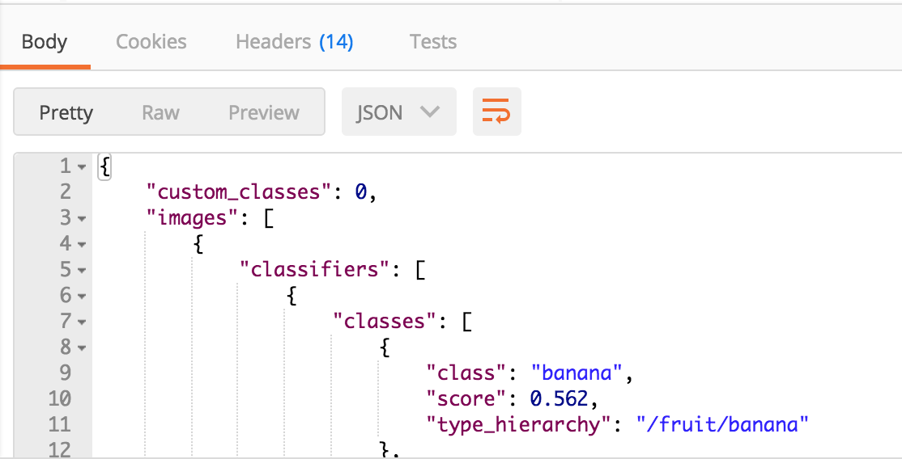
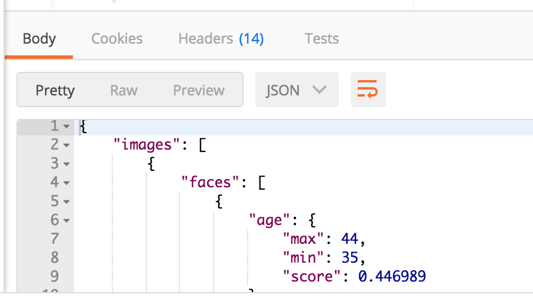
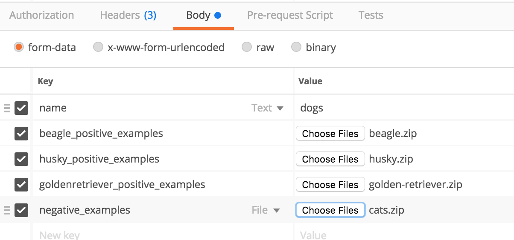
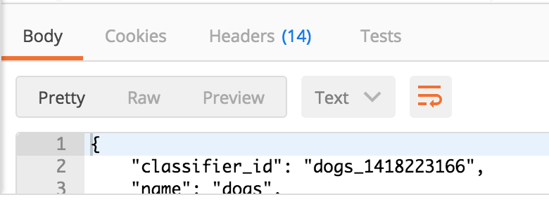
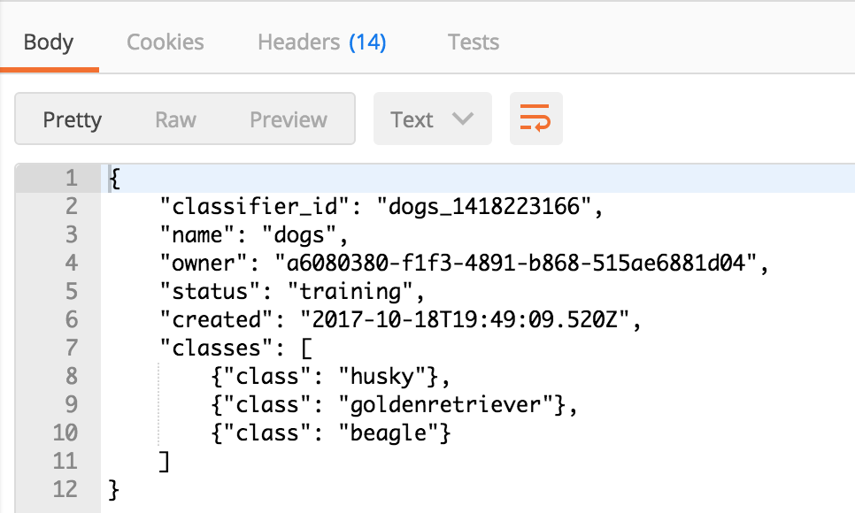
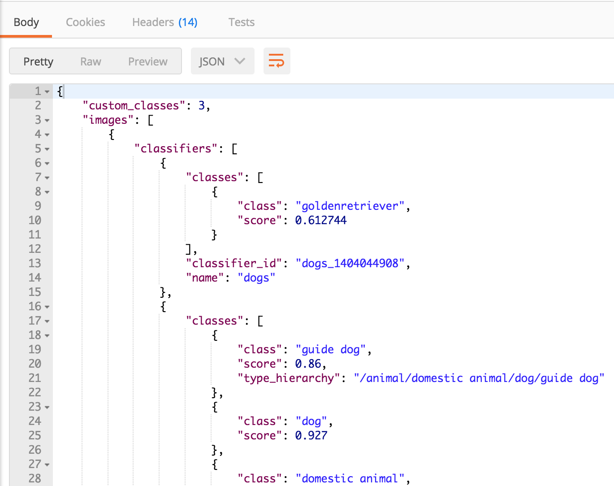

Using the Watson Visual Recognition Service
===========================================

© Copyright IBM Corporation 2017

IBM, the IBM logo and ibm.com are trademarks of International Business
Machines Corp., registered in many jurisdictions worldwide. Other
product and service names might be trademarks of IBM or other companies.
A current list of IBM trademarks is available on the Web at "Copyright
and trademark information" at www.ibm.com/legal/copytrade.shtml.

This document is current as of the initial date of publication and may
be changed by IBM at any time.

The information contained in these materials is provided for
informational purposes only, and is provided AS IS without warranty of
any kind, express or implied. IBM shall not be responsible for any
damages arising out of the use of, or otherwise related to, these
materials. Nothing contained in these materials is intended to, nor
shall have the effect of, creating any warranties or representations
from IBM or its suppliers or licensors, or altering the terms and
conditions of the applicable license agreement governing the use of IBM
software. References in these materials to IBM products, programs, or
services do not imply that they will be available in all countries in
which IBM operates. This information is based on current IBM product
plans and strategy, which are subject to change by IBM without notice.
Product release dates and/or capabilities referenced in these materials
may change at any time at IBM's sole discretion based on market
opportunities or other factors, and are not intended to be a commitment
to future product or feature availability in any way.

Overview
========

In this lab, you will familiarize yourself with the Watson Visual
Recognition service by learning how to classify, detect faces in, and
recognize text in an image, and how to create, train and then use a
custom classifier.

Prerequisites
-------------

You need the following accounts and software:

-   An [IBM Bluemix
    account](https://developer.ibm.com/sso/bmregistration?lang=en_US&ca=dw-_-python-_-watson_-course)

-   An Internet Explorer, Firefox, or Chrome web browser

-   The [Postman tool](https://www.getpostman.com/) . A free REST client
    available on Windows. Mac and Linux . Templates for all the REST
    calls used in the lab are made available as a Postman collection
    which you will import into your own Postman installation

Section 1. Initial set up
=========================

This lab has a few more pre-requisites which will take a portion of the
lab time to install. However, if you are going to work further with
containers on Bluemix, they are tools that are essential so it's worth
the investment.

1.  Download and install Postman for your platform ( if you don’t
    already have it) Instructions are available at the following website
    <https://www.getpostman.com/>

2.  Create a folder on your local machine for this lab and download the
    following file to it:
    
    [vrlabs.zip](labfiles/vrlabs.zip)
    
    Unzip the downloaded file.

3.  Create an instance of the Watson Visual Recognition Service in
    Bluemix..

    Open <https://bluemix.net> in a browser tab to load the dashboard.
    Once open, select **Catalog**

    In the search bar, type **Visual Re**.

    

    Click on the service name to bring up the panel.

    

    Keep all default values..

    Click on the **Create** button to create your instance.

4.  When the service is created click on **Service credentials** at the
    left and then click on **View credentials**. Copy the value of your
    api_key (without the quotes) to a text file as you’ll need it
    several times during the lab

    

5.  Start your Postman app and click on the **Import** button
    
    

  Select **Import File** and then drag and drop or select the file ***Watson Visual Recognition.postman_collection.json*** from the
folder where your unzipped the lab files

   Verify that 6 members of a collection entitled *Watson Visual Recognition* were imported

   

Section 2. Execute REST calls against your instance of Watson Visual Recognition
================================================================================

In this section, you will familiarize yourself with the Watson Visual
Recognition service by making REST calls to classify, detect faces in,
and recognize text in an image, and you will also learn how to create,
train and then use a custom classifier.

1.  First you will classify the following image using the default
    classifier .
   
    
    
    In Postman select the first request in the imported collection. A
    tab on the right will be opened with all the details of the request
    
    

  Click on **Params** and then paste your API key into the **Value** column for the **api_key** parameter

   

  Click the **Send** button to send the request
  
  Verify that a JSON response is returned. Scroll through the results to see the default classifier’s analysis of this image.

   

2.  Next you’ll use the face detection capability on this image:
    
    
    
    In Postman select the second request in the imported collection. A
    tab on the right will be opened with all the details of the request
    
    Click on **Params** and then paste your API key into the **Value** column for the **api_key** parameter.
   
    Click the **Send** button to send the request.
    
    Verify that a JSON response is returned. Scroll through the results to see the what is returned for the face detection function
    
    
    
3.  Next you’ll use the text recognition capability on this image:
    
    
    
    In Postman select the third request in the imported collection. A tab on the right will be opened with all the details of the request
    
    Click on **Params** and then paste your API key into the **Value**
    column for the **api_key** parameter.
    
    Click the **Send** button to send the request
    
    Verify that a JSON response is returned. Scroll through the results
    to see the what is returned for the text recognition function
    
    
  

4.  Next you’ll learn how to create a custom classifier to recognize
    various breeds of dogs
    
    In Postman select the fourth request in the imported collection. A
    tab on the right will be opened with all the details of the request
    
    Click on **Params** and then paste your API key into the **Value** column for the **api_key** parameter.

   Next click on **Body** to see the Form Data that is being passed to the request. Add the following files from the files you unzipped for this lab by clicking on **Choose Files** next to the corresponding parameter

   i.  Select ***beagle.zip*** for **beagle_positive_examples**

   ii. Select ***husky.zip*** for **husky_positive_eaxamples**

   iii. Select ***golden_retriever.zip*** for
    **goldenretriver_positive_examples**

   iv. Select ***cats.zip*** for **negative_examples**

    When you’re done the **Body** should look like this:

    
    
    Click the **Send** button to send the request The request will take awhile to complete as all the files need to be uploaded to the service

    Copy and paste the returned **classifier_id** to the same file as your api_key. You’ll need this is the next steps:
   
   
1.  Custom classifiers are trained asynchronously so in this step you’ll
    check the status of the custom classifier you just created.
    
    In Postman select the fifth request in the imported collection. A
    tab on the right will be opened with all the details of the request
    
    Click on **Params** and then paste your API key into the **Value**
    column for the **api_key** parameter.
    
    Edit the URL of the request and change *dogs_XXXXXXXX* to the id of
    the classifier you saved in the previous step
    
    Click the **Send** button to send the request
    
    Note the returned JSON. The status field shows the state of the
    custom classifier. If the status is set to *training* it means that
    the classifier has not been completely trained yet
    
    
    
    Keep sending this request until the status changes to *ready*

2.  In this final part of the exercise you’ll run the following image
    against both your custom classifier and the default classifier.
    
        
    
    In Postman select the sixth request in the imported collection. A
    tab on the right will be opened with all the details of the request
    
    Click on **Params** and then paste your API key into the **Value**
    column for the **api_key** parameter.
    
    Change the *dogs_XXXXX* part of the **classifer_ids** parameter to
    the classifier id of your custom classifier
    
    Click the **Send** button to send the request
    
    Note the returned JSON. Scroll through the results to see the output
    organized by classifier . The results from your custom classifier
    should appear first followed by the results from the default
    classifier.
    
    

Summary
-------

In this lab, You created an instance of the Watson Visual Recognition
Service and completed the following tasks:

1.  [Classifying an
    image](https://www.ibm.com/smarterplanet/us/en/ibmwatson/developercloud/doc/visual-recognition/tutorials.shtml#classify)

2.  [Detecting faces in an
    image](https://www.ibm.com/smarterplanet/us/en/ibmwatson/developercloud/doc/visual-recognition/tutorials.shtml#faces)

3.  [Recognizing text in an
    image](https://www.ibm.com/smarterplanet/us/en/ibmwatson/developercloud/doc/visual-recognition/tutorials.shtml#text)

4.  [Creating a custom
    classifier](https://www.ibm.com/smarterplanet/us/en/ibmwatson/developercloud/doc/visual-recognition/tutorials.shtml#create_train)

5.  Checking the status of a custom classifier

6.  [Classifying an image with a custom
    classifier](https://www.ibm.com/smarterplanet/us/en/ibmwatson/developercloud/doc/visual-recognition/tutorials.shtml#classifycustom)

